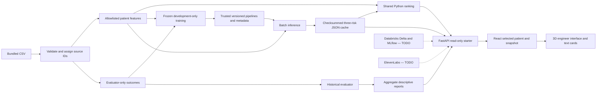

# Scaffold architecture

Solid arrows are the local starter. Dashed arrows require owner implementation and
real integration verification. This diagram describes boundaries, not deployed services.

`domain/` owns deterministic calculations; no database/provider/training side effects.
`data/` separates outcomes from features at ingest. `evaluation/` may access outcomes
and publishes aggregates. `ml/` supplies frozen training, inference and publication.
The API loads only JSON through `repositories/predictions.py`; model loading stays offline.
`services/` owns the one patient evidence envelope. `api/` adapts it to HTTP/Pydantic.
`repositories/` is the backend owner's data/persistence interface. React owns selected
patient/snapshot and rejects stale responses. The engineer's anatomy module consumes
interpreted indicators and emits organ-selection events, without CSV or scoring logic.

Databricks is the intended primary data/ML and durable event backend. Local SQLite is
an optional cache/outbox to implement, not an existing primary store. A vector database,
multi-agent framework, task queue, and production healthcare deployment are not required.

Default frontend development proxy: browser `/api/v1` → FastAPI `127.0.0.1:8000`.
No provider key enters browser code. Real voice webhooks need protected HTTPS reachable
by ElevenLabs; browser client tools are the alternative for a local API.
