# Application architecture

```mermaid
flowchart LR
  CSV[Bundled CSV] --> Ingest[Validate and assign source IDs]
  Ingest --> Features[Allowlisted baseline features]
  Ingest --> Outcomes[Evaluator-only outcomes]
  Features --> Train[Explicit development-only training]
  Outcomes --> Train
  Train --> Artifacts[Trusted immutable pipelines and metadata]
  Artifacts --> Inference[Frozen inference]
  Features --> Inference
  Inference --> Cache[Checksummed three-risk JSON cache]
  Cache --> Rank[Shared Python ranking]
  Outcomes --> Benchmark[Historical evaluator]
  Benchmark --> Reports[Fixed aggregate reports]
  Rank --> API[FastAPI application service]
  Reports --> API
  API <--> Events[Repository: local SQLite or configured Databricks]
  API --> React[React selected patient and snapshot]
  React --> Viewer[Existing asset viewer and text cards]
  React --> Mutation[Confirmed patient commands]
  Mutation --> API
  API -->|Changed baseline facts only| Inference
  Inference -->|Three outputs before save| API
  React <-->|Private session and client tools| Voice[ElevenLabs]
  Voice -.->|No direct localhost access| React
  Databricks[Delta and MLflow integration] -.-> Artifacts
```

The local app, SQLite journal, frozen inference and private ElevenLabs adapter are
implemented. Live Delta/MLflow publication and device-level integration evidence remain
owner work. This diagram describes existing boundaries, not a deployed clinical service.

`domain/` owns deterministic calculations without provider/training side effects.
`data/` separates outcomes from baseline facts at ingest; only `evaluation/` and explicit
training use individual outcomes. `ml/` supplies training, inference and publication.
Ordinary API reads load JSON through `repositories/predictions.py`. Patient POST/PUT
lazily deserialize the exact trusted immutable pipelines loaded for this session,
infer all three scores and persist them with the facts. They never fit or tune models.

`services/` owns the shared patient evidence envelope, event replay and session revision.
Snapshots copy their baseline facts and all three risk outputs; patient and voice reads
use that same envelope. Patient writes and composite voice reads share a local session
lock. The repository protocol preserves confirmed commands, audit history and retry
receipts. Local SQLite records pending-sync events; a configured Databricks adapter is
capability-gated. Run one API worker per session; this is not multi-process coordination.

React serializes writes with ranking commands, clears caches after patient changes and
ends stale voice context before refresh. The picker includes eligible records outside
Top 25. Risk Score passes independent heart/kidney model outputs to the current
`AnatomyViewer`; Tissue State uses EF/creatinine measurements. Geometry remains the
engineer's responsibility. The alternate `anatomy/adapter.ts` is a future handoff.

Default frontend proxy: browser `/api/v1` → FastAPI `127.0.0.1:8000`. ElevenLabs keys
stay on the server; the browser receives a signed private session and scoped local
read-only tool grant. ElevenLabs does not call localhost directly. Browser-combined
ML/points rankings retain factual fallback because they have no backend snapshot.
See [the ML/dashboard audit](ml-dashboard-audit.md) for verified paths and boundaries.
